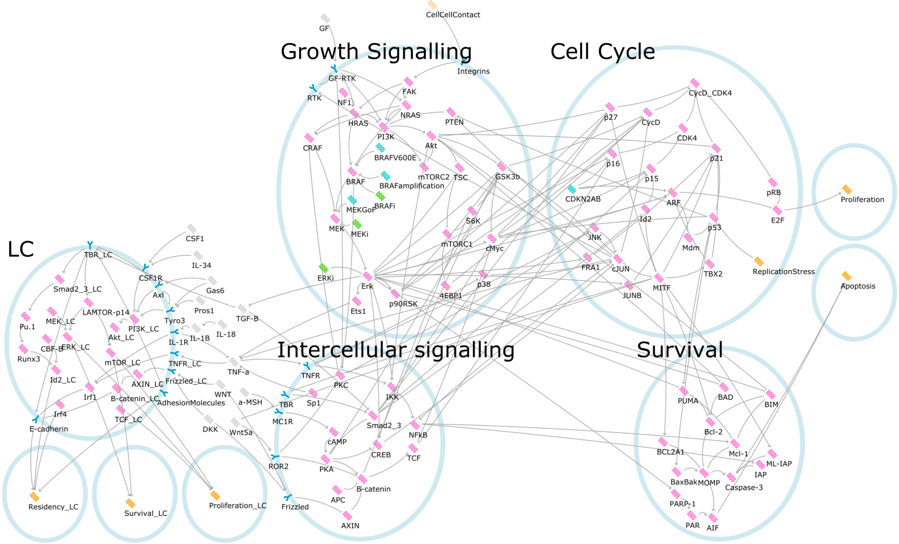
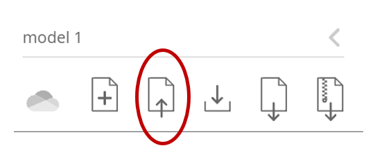

# Localised Immune Surveillance of Primary Melanoma in the Skin Deciphered through Executable Modelling

## Overview

Network model `.json` file for the Langerhans Cell (LC), Melanoma and combined models first described in Howell et al. (in preparation).

The LC model predicts the behaviour of these cells in response to extracellular signalling molecules, while the Melanoma model predicts the behaviour of tumour cells in response to somatic mutations or targeted therapies. The combined Melanoma-LC model incorporates melanoma-derived TNF signalling to predict LC behaviour in the skin adjacent to tumour cells. The models are Qualitative Networks (QN), built and analysed using [Bio Model Analyzer](https://biomodelanalyzer.org) (BMA).

## Instructions

The `.json` file for each of the networks can be used to explore the models in the [Bio Model Analyzer](https://biomodelanalyzer.org) (BMA) tool. To import the network JSON file, use the "Import" button in the left hand tooltab.

The model can also be explored using a local installation of [BMA](https://github.com/hallba/BioModelAnalyzer). BMA can currently only be built on Windows.

## Citing

Publication in preparation.

This repo is archived on Zenodo at .

## License

This project is licensed under the MIT License - see the [LICENSE](LICENSE) file for details.
